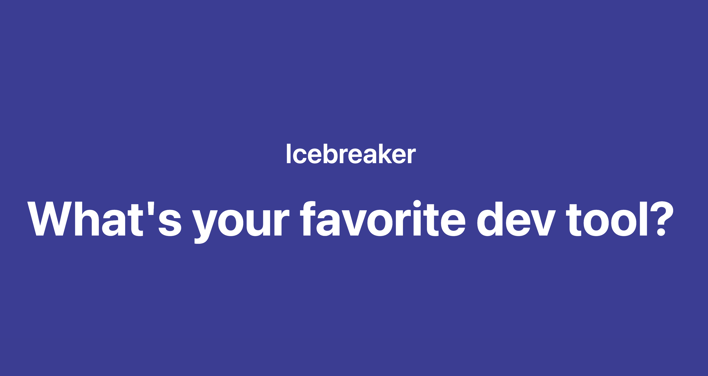
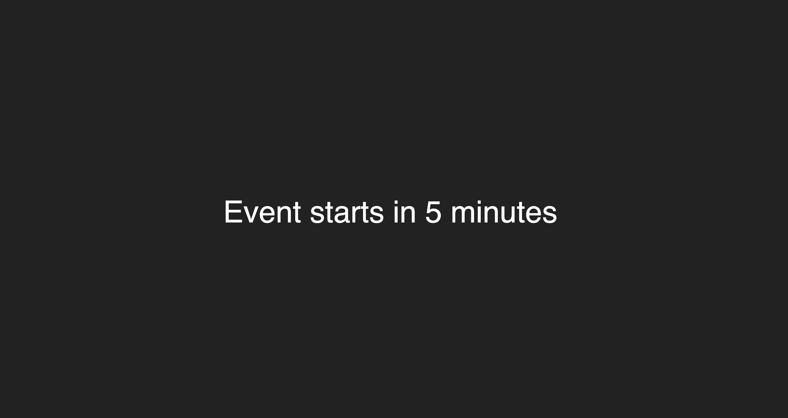
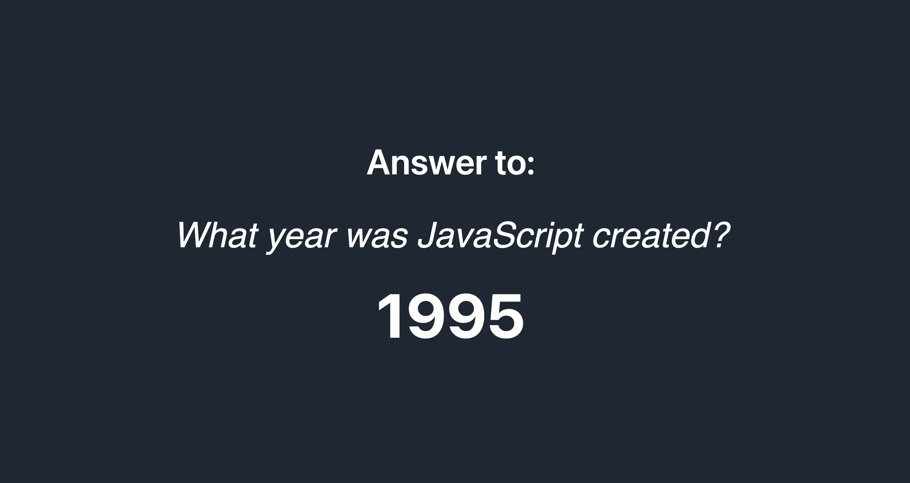

# Loading Soon

Pre-event screen for meetups. Shows a countdown, rotating trivia, and icebreaker questions while people settle in.

This is a *last minute* **prototype/demo** — a proof of concept for the full app.

<p align="center">
  
  
  
</p>

Live demo: https://intelagense.github.io/loadingsoon/

## How It Works

- Click the hamburger menu to open settings.
- Set the event start time using the date picker.
- Add slides by editing markdown.

### Slide Format

Use markdown sections with headings for each type of content. Questions and answers should be separated with a pipe character. "|"

```markdown
## trivia
What year was JavaScript created? | 1995  
Who created Python? | Guido van Rossum

## icebreakers
What's your favorite dev tool?  
What's a side project you've abandoned but still think about?  
What's your most controversial tech opinion?
```